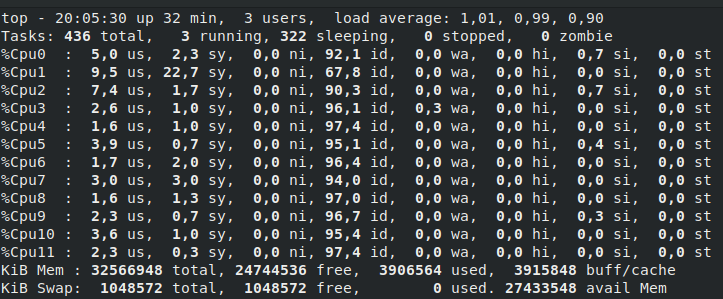

# Docker Security {bg=#000;assets/img/security.jpeg}

# Docker Security

##
Container security is Linux kernel security

## Linux kernel security
- Kernel namespaces
- Control groups
- Add / Drop cpabilities
- Seccomp
- SELinux
- AppArmor
- ...

## Image Security

- Use trusted (or signed) Images
- Or build own
- Use image scanner (paid feature)
- Do not run privileged
- Run process as non-root user

## Limit Ressources

Parameter | Description
------------ | -------------
cpus | Limit CPUs usage (0.1 - 1)
cpuset-cpus	 | Limit the specific CPUs or cores a container can use
memory | The maximum amount of memory 
memory-reservation	 | Soft Limit

## Example
Disarm a fork bomb
```
docker run -u 1000 ubuntu bash -c ":() { : | : & }; :; while [[ true ]]; do sleep 1; done"
```

## Example (Answer)
Limit the Pids!
```
docker container run --pids-limit 100 -u 1000 ubuntu bash -c ":() { : | : & }; :; while [[ true ]]; do sleep 1; done"
```

## Exercise
- Start Alpine and limit ressources to use only 1 CPU with 50%
- Stress the CPU with
```dd if=/dev/zero of=/dev/null```
- See top and docker stats

## Exercise (Answer)
```sh
# Start Container
docker run -it --cpus 0.5 --cpuset-cpus 1 alpine

# Check
top
docker stats
```

## Exercise (Answer)



## Network Security
- Seperate Docker networks
- In Swarm/K8s: Overlay networks
- WeaveNet/Overlay: Encryption

## Network Security
```
docker network create \
    --opt encrypted \
    --driver overlay \
    --attachable my-attachable-multi-host-network
```
